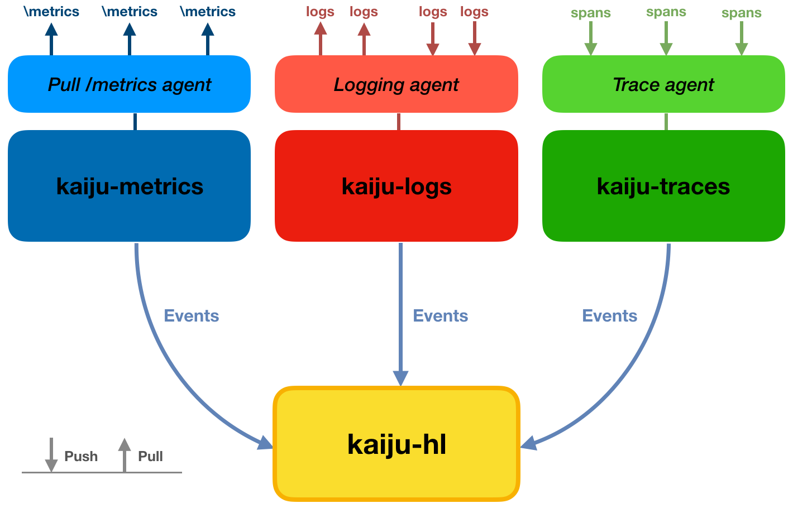

# Kaiju

<!---
The content of this repository is discussed in details in:
```
A Success Story of Event-Driven Observability in Production-Grade Container Orchestration
Authors: Mario Scrocca, Riccardo Tommasini, Alessandro Margara and Emanuele Della Valle
```
-->
  
_Kaiju_ is an artifact based on the [Esper engine](http://www.espertech.com/) and implementing event-driven observability in container orchestration through Kubernetes.

Key aspects:
- _Kaiju_ can process observations (i.e. metrics, logs and traces) as events in real-time
- _Kaiju_ is an easily-pluggable solution for companies already implementing projects of the CNCF stack
- _Kaiju_ implements a modular solution to take into account the different processing required in dealing with metrics, logs and traces
- _Kaiju_ enables the definition and processing of custom and configurable types of events between different components

<p align="center"></p>

## Respository structure

The repository is organized in 5 main folders:
- `kaiju`: Contains the source file for _Kaiju_ modules.
- `rim`: Contains a modified version of the [HotR.O.D.](https://github.com/jaegertracing/jaeger/tree/v1.5.0/examples/hotrod) demo application by Uber.
- `kube`: Contains manifests to launch an environment for experiments using a Kubernetes cluster.
- `fluentd-kaiju`: Contains files to build the modified _fluentd_ image reporting logs to _Kaiju_.
- `kaiju-agent`: Contains files to build the modified agent reporting traces to _Kaiju_.

## `kaiju`

Kaiju is composed of four different types of modules, each one can collect a different sort of data, and can forward generic events modelled as POJO (`Event.java` class in the Kaiju project). The modularization enables horizontal scalability for each type of module and the hierarchical composition of `kaiju-hl` modules. 

The `Kaiju` image can be built using the `DockerFile` provided and then launched with different arguments to execute the four different models. Available arguments are:
- `--mode` or `-m` (**Required**) to set the type of module to be executed. Values can be `traces`,`logs`,`metrics`, `high-level`. 
- `--parse` (default `true`) to set whether or not the file `stmts/statements.txt` should be parsed looking for statements to be installed.
<!--- An additional value `traces-api` can be used to initialize the `kaiju-traces` module together with an API to inspect spans retained in time windows defined by retentionTime parameter -->
- `--rtime` or `-rt` (default `2min`) to set the retention time to be substituted in statements using the `:retentionTime:` placeholder.

Syntax of `statements.txt` files is: `key-config` : `value-config` `[,key-config:value-config]*`=`statement`. One statement for each line. `#` at the beginning of a line comments it out.

#### `kaiju-metrics`

To integrate `kaiju-metrics` with the CNCF stack, we would like to receive data from an agent that pulls Prometheus endpoints. We choose to adopt the [Telegraf agent](Telegraf https://www.influxdata.com/time-series-platform/telegraf/) from Influx and its plugin to scrape Prometheus endpoints. This plugin allows to manage simple endpoints, multiple endpoints load-balanced from a service and  resources annotated for scraping. Deploying a set of agents in the different nodes of the cluster allows to collect metrics forwarding them to the `kaiju-metrics` component. We model each metric as a POJO taking into account the Telegraf output format: the timestamp when the metric were collected, a name, a key-value map of tags as labels and a key-value map of fields representing values sampled.

#### `kaiju-logs` 

To integrate `kaiju-logs` with the CNCF stack, we would like to implement a unified logging layer for all cluster logs. We chose then to provide a solution based on \emph{Fluentd} and requiring little modifications to configuration files. We implemented an output plugin able to forward data to the `kaiju-logs` component, and we specified the `DockerFile`s to build a customer `fluentd-kaiju` image integrating this plugin (available in folder `fluentd-kaiju`). We model each log as a POJO with a key-value map of fields. The main problem with logs is related to the multitude of different formats, often not structured and difficult to parse. For this reason, we choose to adopt the ingestion time as timestamp for logs and to process them trying to flatten JSON based syntax in a map of fields

#### `kaiju-traces`

To integrate `kaiju-logs` with the CNCF stack, we would like to be able to retrieve traces from applications instrumented with the [OpenTracing](https://opentracing.io/) API. We chose to exploit language-dependent client libraries provided by _Jaeger_ and we implement a custom version of the _jaeger-agent_ reporting them to the `kaiju-traces` component (available in folder `kaiju-agent` together with the `DockerFile`). As in \emph{Jaeger} the agent receives spans in push on a UDP port and forwards data to the specified collector. We model each span and its contained events as a set of POJOs, as defined in the internal _Jaeger_ model. We consider as timestamp for spans the ingestion time.

#### `kaiju-hl`

`kaiju-hl` accepts socket connections from other modules to collect events. `kaiju-metrics`, `kaiju-logs`, `kaiju-traces` or other `kaiju-hl` modules can forward data assigning statements to a specific listener. `kaiju-hl` accepts only events parsable to the POJO described in the `Event.java` class, but offers the possibility to configure, from file `stmts/events.txt`, a set of different events that are extracted from this incoming stream. The configuration files requires to specify for each event, the name of the event, pairs key-datatype for payload, pairs key-datatype for context, name of inherited events. For each event configured it is automatically created: (i) a `create schema` statement; (ii) an `insert into` statement from the `Event` stream, checking existence of keys in the payload to identify items and selecting event properties in payload/context.

- Syntax of `events.txt` files is: `event-name`>{`payload-key`:`type` `[,payload-key:type]*`}>{`context-key`:`type` `[,context-key:type]*`}>{`inherits-event-name` `[,inherits-event-name]*`}

## `rim`

The `rim` folder contains a modified version of the [HotR.O.D.](https://github.com/jaegertracing/jaeger/tree/v1.5.0/examples/hotrod) demo app from Jaeger:
- composed of four micro-services deployable separately;
- enabling configurable introduction of source of latency/errors (see related ConfigMap in `kube` folder for available modifications);
- enabling possibility to generate load tests through embedding of the [makerequests.js](https://github.com/marioscrock/makerequests.js) library;
- instrumented with OpenTracing to report also Kubernetes metadata.

## `kube`

An environment for experiments can be run downloading `kustomize` and setting up `kubectl` to communicate with a Kubernetes cluster. `kube` folder contains manifests.

```
cd kube
kustomize build | kubectl apply -f -
```

The basic deployment is based on a micro-service application running in a Kubernetes cluster and comprises:
- the _Rim_ app with each service scaled up to 3 replicas;
- components talking with the Kubernetes API to emit additional cluster metrics ([_node-exporter_](GitHub - prometheus/node_exporter: Exporter for machine metrics;
https://github.com/prometheus/node_exporter), [_kube-state-metrics_](https://github.com/kubernetes/kube-state-metrics)) and logs ([_event-router_](https://github.com/heptiolabs/eventrouter));
- _Kaiju_ basic deployment with one module for each type;
- the _Telegraf_ and _Fluentd_ agents properly configured on each node;
- the custom agent to collect traces deployed as sidecar in pods of \emph{Rim}.

To launch a golang-based load test created with the `Rim` application you should build the image `hotrod-load` in folder `kube/load` and deploy the Kubernetes Job using the provided manifest.
